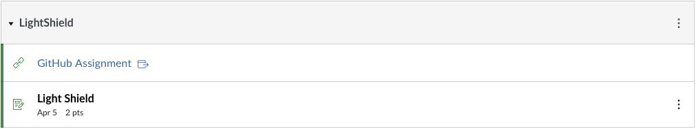
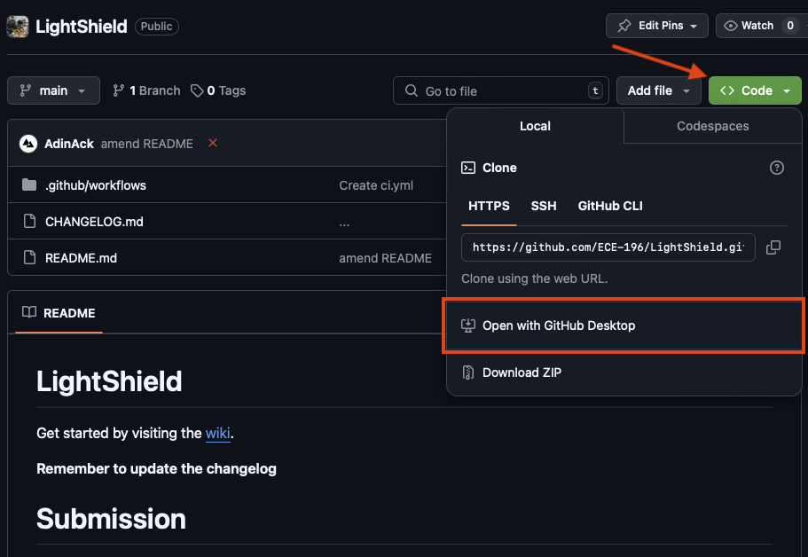
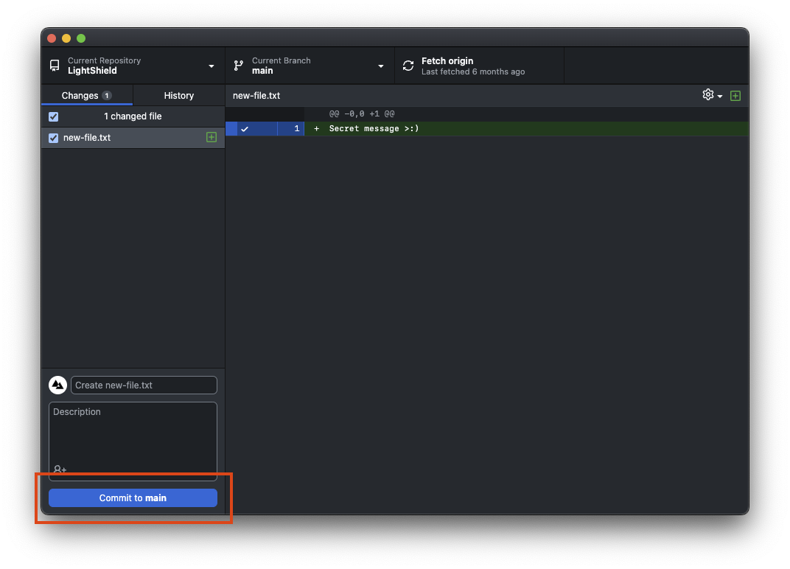
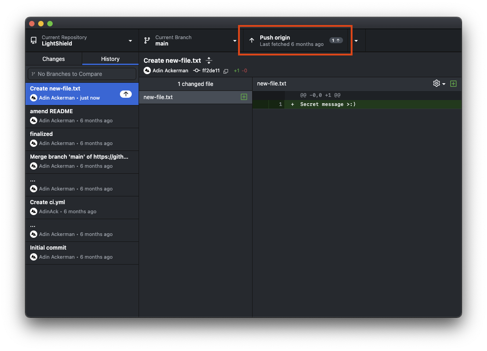
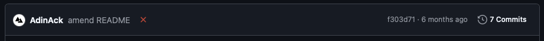

We will be using GitHub for technical assignments in this class, this may be a first for many of you,
so we will explain this process from the very beginning.

## GitWhat?

**GitHub** is a cloud service for hosting projects (usually code related) with collaboration as a
primary feature. GitHub uses **Git** as its underlying means of version control[^1].

Git is by far the most popular version control software. GitHub provides stellar introductory
guides [here](https://github.com/git-guides).

## Setting Up

First of all, make sure to create a GitHub account [here](https://github.com/join).


  You *may* use your UCSD email, but it is not necessary.


Next, download and install [GitHub Desktop](https://desktop.github.com/download/), a user interface for using Git and GitHub.

> Of course, if you know what you're doing and would rather use a different client or CLI, you are welcome to.

Log in with your GitHub account.

## Assignments

Let's walk through the process of accepting and submitting assignments with GitHub.

### Accepting

Go to Canvas, and navigate to an assignment module. For example, LightShield:

Click the "GitHub Assignment" link. You will be prompted to accept the assignment.

The assignment repository page will open. You can clone (download) your assignment repository via GitHub Desktop with this menu:

Now, when you make changes, they will be reflected in GitHub Desktop.

When you wish to record your changes to be preserved locally (your computer), click "commit":

When you wish to upload your changes to GitHub, click "push":

## Submitting

To submit an assignment, you just need to make sure your work is "pushed" as described previously.

The assignments provide a an indicator for whether the expected submission files are present or not.

It is visible on the assignment page, and you will receive emails if the check fails. The check runs every
time you push changes.

An ❌ indicates failure, and a ✅ indicates success.


  This check **DOES NOT** indicate assignment completion nor incompletion. It simply informs you if the required
  submission files are present or not. Almost every assignment requires supporting files to be present for manual
  review.


[^1]: Version control is the process of tracking and manipulating changes to the content of a project over time.
