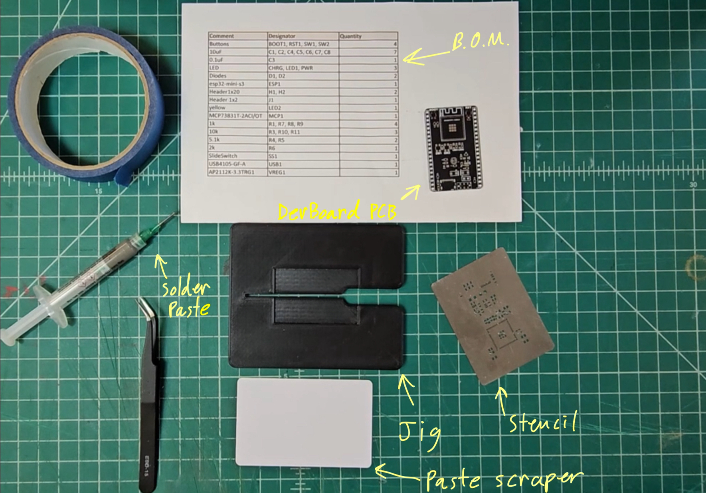
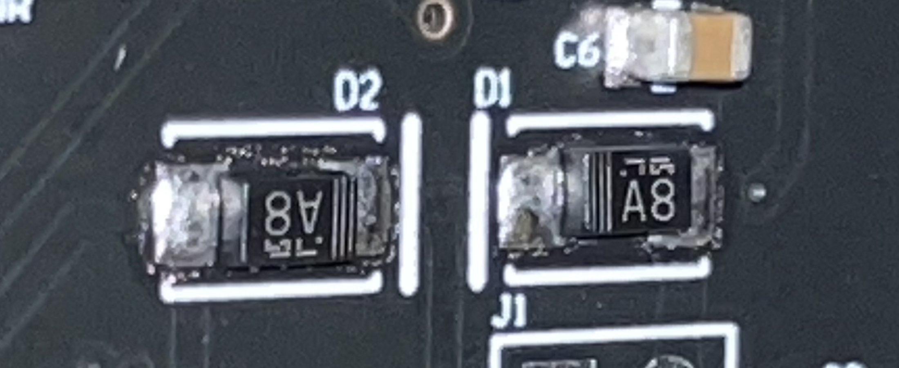
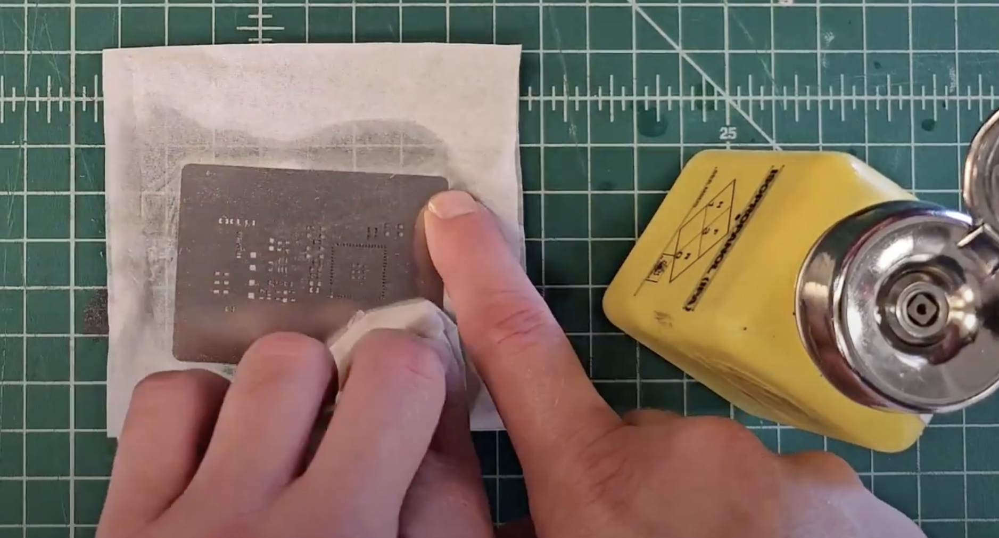

## Video Walkthrough

There is a video walkthrough for this process [here](https://youtu.be/2PzJOzyYS3M?si=xmUvoAxYBVRmF37I).

## Step-by-step

{}

### Required Materials

Grab:

- Jig
- Stencil
- Paste spreader
- Tweezers
- Masking tape
- Solder paste
- DevBoard PCB


Write your initials in sharpie on the back of the PCB so you don't get it mixed up with other students in some later steps.


You may first need to clean the stencil if it has solder paste on either side. To do this you will need
isopropyl alcohol (found in Envision), and a paper towel. After wetting the paper towel with the alcohol,
gently clean the dirty side(s) of the stencil, being careful not to deform it.

Once you have all of your tools and a clean stencil, take your PCB and place it _flush_ in the jig. Then, take the
stencil and line it up with the PCB. Once you have it lined up well, you can tape one side of the stencil down. Now take time and
care to line up every hole in the stencil with every pad on the PCB. You should only see metal pads through the stencil holes, with none
of the black substrate visible. Tape the stencil down on the other end, ensuring that the stencil is still lined up.

Now, take the solder paste and put a ~3mm wide (As wide as the stick of a lollipop) along one of the taped sides. Take your
spreader and, while pressing down on the stencil, spread the solder paste along the stencil. When doing this, make sure you fill
every hole in the stencil without leaving excess paste on the stencil surface.

| setup                         | spread                          |
| ----------------------------- | ------------------------------- |
|  |  |

Once you have solder paste flush in all of the stencil holes, very carefully remove the tape from one side of the stencil and lift the stencil off of the PCB.
You should see a thin layer of solder neatly covering each pad. Make sure that none of the solder paste is bridging pads together. Pay close attention to the USB-C pads, as they have the least clearance.

If you have any bridging, you will have to clean the PCB and stencil with isopropyl alcohol and try again. Trust me, it is much easier
to restart at this point, rather than trying to deal with the bridging later. If no bridging is present, and every pad has solder paste, then you
can move on to the next step after you clean the stencil.

### Component Placement

Now we will start placing our components.

As you work, you can request the components you need from the TAs at the component table.

To find out what you need, refer to the BOM[^1] [here](https://github.com/ECE-196/DevBoard/blob/main/BOM.xlsx).

Once you have a component from the B.O.M. you can see which PCB labels the component corresponds to in the _designator_ column. With tweezers,
carefully place each component on to the labeled position on the PCB. Make sure that the components you place are centered on the pads, and be careful not
to smear the paste.

for the USB-C connector, you can use Collin's trick to smear solder paste on the legs of the connector, so it will be soldered in place after the oven.
If you do not use this trick, you can turn the board around after it's been in the oven, and solder the four mounting points of the USB-C connector manually.

The orientation of the resistors and capacitors does not matter. There are components which have specific orientations:

- For the diodes, there is a line on the component that you must put on the same side as the white line printed on the PCB next to the diode positions.

- The LEDs have a small green arrow-like shape on the bottom, the pointier end indicates ground, which must be lined up with the white lines on the PCB.
- The longer end of the ESP32 lines up with the outlined space on the PCB.
- The buttons are oblong rectangles, and need to be aligned with their rectangular pads.
- The switch should have the shiny side facing upwards, and the lever facing away from the center of the PCB.

- The two 5 pin components will have only one orientation where all pins are in contact with the pads.

When you have all of the components placed, try to check with a TA to confirm your components are placed correctly.

### Reflow

It is now time for the oven. Go to a TA to get your board in line for the reflow oven. The oven takes around 20
minutes, so boards will be done in batches.

When you get your board back from the oven, inspect the solder points to make sure no bridging occurred. In our
experience, this will mainly be the USB-C pins that can experience bridging. You can use the
microscope in envision to get a good look at your USB-C connector, you are looking for any solder that is touching between pins.

> A USB connector with no bridged pins

If you do not have any solder bridging, then you are done.

However, if there is bridging present, you wall have to do your best to remove the solder that is causing the bridging.

You can use the copper solder wick in Envision, along with solder flux, to remove the excess solder:

- first put a small amount of flux on the bridged pins
- then press the solder wick into the pins with a sodlering iron
- check the pins to see if you fixed the bridging
- repeat these steps until you fix the bridging

Alternatively, you can use a heat gun to remelt the solder holding the USB-C connector down, and lift the connector off of the board.
Place the connector back down, remove the heat gun, and look again at your pins to see if that fixed the bridging.
...

{}

## Things to Consider

- If your solder paste didn't turn out clean, it is much easier to just repaste. Don't try to make it work if you know you can do better.
- Double check the BOM as you place components, while you can take components off of the paste if, it can easily cause bridging.
- Take your time on every step, this is a very delicate process.

### Good housekeeping

We will be sharing stations and stencils in this assignment. Once you have successfully applied solder paste to your board,
clean your stencil and jig so the next person can start with their board right away.

The stencils are very delicate, and can be rendered useless with just a small bend. In order to clean the stencil, place it flat
on the table and gently rub the alcohol wipe across the top of the stencil, as shown. Flip the stecil and repeat the process.

[^1]: A **B**ill **O**f **M**aterials (BOM) is a document outlining the required components quantities and placements for a board.
