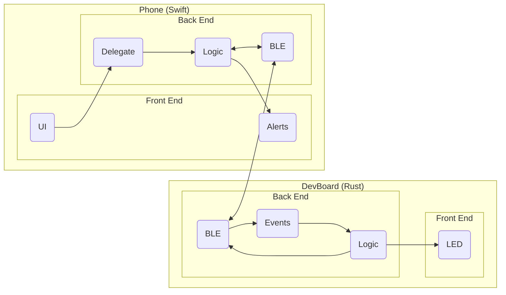
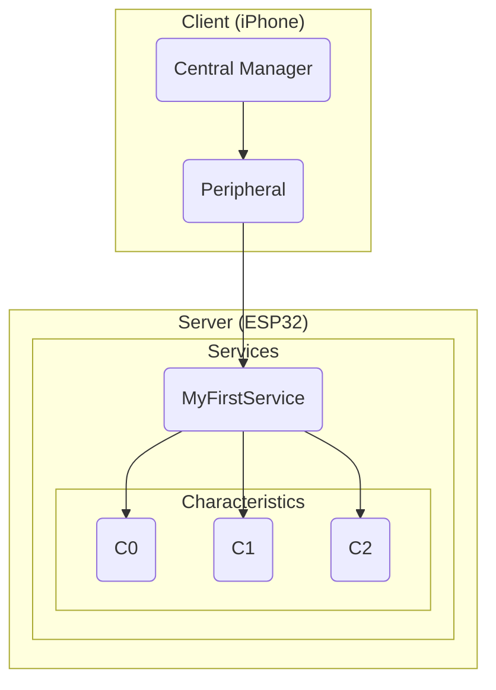

Let's take a look at the hierarchy of the system we are about to design:

Now, I know this looks complicated, but we will tackle each block one by one, nice and slow.

Once you are done with this, you will have a solid understanding of creating systems involving
bidirectional communication between 2 devices, which is *super* useful for *a ton* of
applications (including your final project).

So let's get started.

## How Does BLE Work?

Modern BLE (Bluetooth Low Energy) systems rely on the *Service -> Characteristic* architecture.

Your iPhone can scan for BLE devices advertising **services**, to decide whether to connect to them or not.

A service is like an Object, it contains states, and represents some kind of data or behavior.

Services contain **characteristics**, which are the states of the service. You can configure characteristics to be readable and writable.

In this case, we will have one service with one characteristic: *LED*.

Here is a flowchart of how our BLE system will work:

This layout is called **GATT** (Generic ATTribute Profile)
