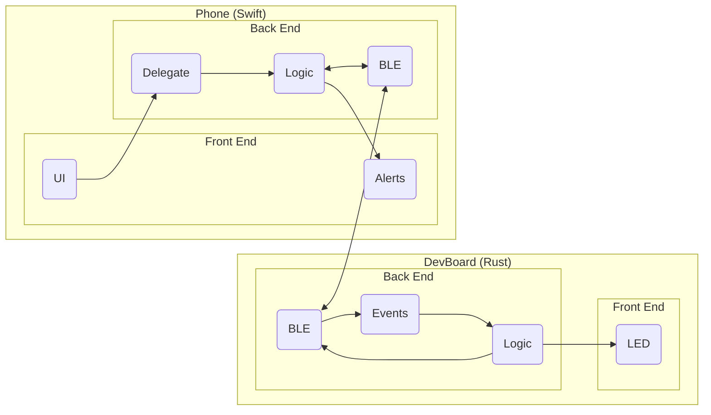

Let's take a look at the hierarchy of the system we are about to design:

Now, I know this looks complicated, but we will tackle each block one by one, nice and slow.

Once you are done with this, you will have a solid understanding of creating systems involving
bidirectional communication between 2 devices, which is *super* useful for *a ton* of
applications (including your final project).

So let's get started.
