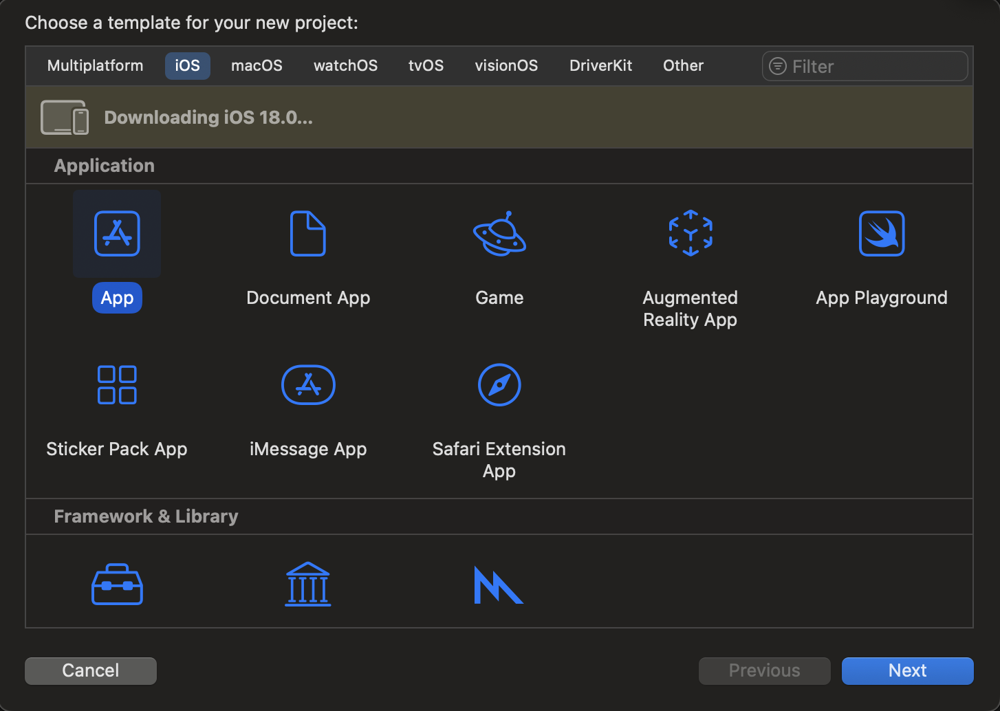
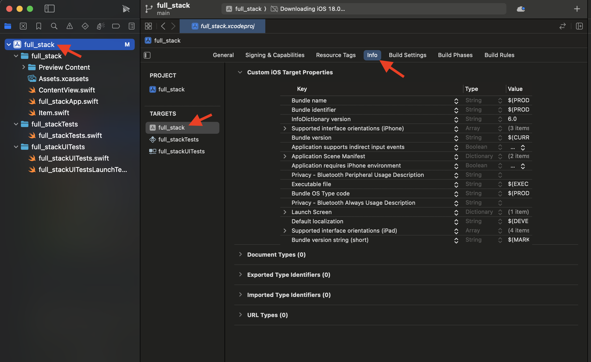
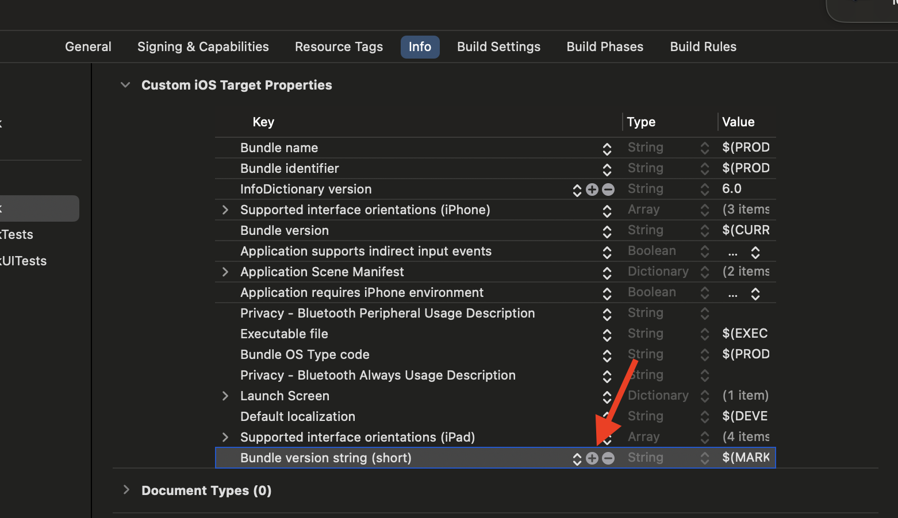
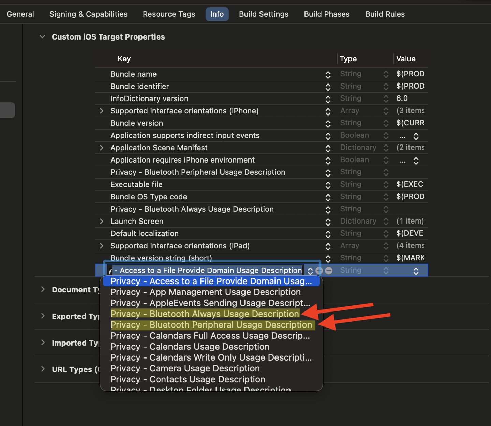
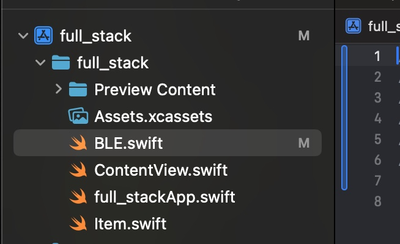

Rather than using NRF Connect, let's make an app to interact with our device.

Open XCode and create a new iOS project.



Before we get started, we need to enable the BLE access specifiers in the info pane.




> The operating system grants resource permissions on a per-request basis. Our app can't
> use these protected resources without asking.

## Model

Create a new file called `BLE.swift`.



This is where we will create the model for BLE.

To start, define an observable class to delegate central manager and peripheral
events:

```swift
import CoreBluetooth

@Observable
class BLE: NSObject, CBCentralManagerDelegate, CBPeripheralDelegate {
    // more to come...
}
```

Add a static `Logger` instance so we can log events to help with debugging:

```swift
import os

class BLE: NSObject, CBCentralManagerDelegate, CBPeripheralDelegate {
    // logger for this class
    private static let LOGGER = Logger(subsystem: Bundle.main.bundleIdentifier!, category: BLE.description())
}
```

Let's create a type to represent different kinds of data we expect to read or write:

```swift
enum Endpoint {
    case led
}
```

For now there is only one piece of data we care about: the state of the LED, but in the future you may
add more.

Let's store the service and characteristic UUIDs:

```swift
// expected service UUID
static let SERVICE_UUID: CBUUID = CBUUID(string: "937312e0-2354-11eb-9f10-fbc30a62cf38")
// expected characteristic UUIDs
static let CHARACTERISTIC_MAP: [CBUUID: Endpoint] = [
    CBUUID(string: "957312e0-2354-11eb-9f10-fbc30a62cf38"): .led,
]
```

and add our first member, the central manager:

```swift
// the central manager store
var centralManager: CBCentralManager!
```
> The `!` indicates that this value can be `nil` but we guarantee it to be
> filled before the first time it is read.

Acting as a delegate for the central manager begins in the constructor:

```swift
override init() {
    super.init()

    // attach to the central manager
    centralManager = CBCentralManager(delegate: self, queue: nil)
}
```

Now we can define the behavior for when the central manager's state changes:

```swift
func centralManagerDidUpdateState(_ central: CBCentralManager) {
    switch central.state {
    // if the central manager is on...
    case .poweredOn:
        // ...start scanning
        startScanning()
    default:
        Self.LOGGER.error("Central manager state is not powered on.")
    }
}
```

We only care for the central manager to be powered on, so let's log an error if that is not the case.

We haven't defined the primitive `startScanning` yet, so let's do that:

```swift
func startScanning() {
    Self.LOGGER.info("Scanning...")
    // start scanning for devices advertising the expected service
    centralManager.scanForPeripherals(withServices: [Self.SERVICE_UUID])
}
```

and for later, `stopScanning`:

```swift
func stopScanning() {
    centralManager.stopScan()
}
```

To connect to a peripheral and delegate its events, we need to store it
as a member (similarly to the central manager):

```swift
// the peripheral store
var peripheral: CBPeripheral?
```
> The `?` indicates that `nil` is a possible value for this member. This is called an *optional*.

We are eventually going to start keeping track of handles to discovered characteristics,
so let's add a member for that:

```swift
// discovered characteristics
var characteristics: [Endpoint: CBCharacteristic] = [:]
```

Let's implement the event handler for when the central manager discovers a viable peripheral:

```swift
// when the central manager discovers a peripheral...
func centralManager(_ central: CBCentralManager, didDiscover peripheral: CBPeripheral, advertisementData: [String : Any], rssi RSSI: NSNumber) {
    Self.LOGGER.info("Discovered peripheral: \(peripheral).")

        // ...store the peripheral...
        self.peripheral = peripheral
    // ...and connect to it
    centralManager.connect(peripheral)
}
```

And now when a connection is established:

```swift
// when the central manager connects to a peripheral...
func centralManager(_ central: CBCentralManager, didConnect peripheral: CBPeripheral) {
    Self.LOGGER.info("Connected to peripheral: \(peripheral).")

    // ...assign this instance as the peripheral delegate...
    self.peripheral!.delegate = self
    // ...and discover the expected services of the peripheral
    self.peripheral!.discoverServices([Self.SERVICE_UUID])

    // no longer need to scan since a connection has been made
    stopScanning()
}
```

And naturally undo this when a peripheral disconnects:

```swift
// when the peripheral disconnects...
func centralManager(_ central: CBCentralManager, didDisconnectPeripheral peripheral: CBPeripheral, error: (any Error)?) {
    Self.LOGGER.info("Disconnected from peripheral: \(peripheral).")

    // ...invalidate peripheral and characterstic handles
        self.peripheral = nil
    characteristics = [:]

    // resume scanning to potentially connect again
    startScanning()
}
```

When services are discovered, we want to begin discovering the expected characteristics:

```swift
// when all services have been discovered...
func peripheral(_ peripheral: CBPeripheral, didDiscoverServices error: (any Error)?) {
    let services = peripheral.services!

    Self.LOGGER.info("Discovered services: \(services).")

    // ...for each discovered service...
    for service in services {
        // ...if the service is the service we are looking for...
        if service.uuid == Self.SERVICE_UUID {
            // ...discover all expected characteristics from that service
            peripheral.discoverCharacteristics(Array(Self.CHARACTERISTIC_MAP.keys), for: service)
            break // don't care about other services
        }
    }
}
```

And for each characteristic, we want to store its handle and read its value:

```swift
// when all characteristics of a service have been discovered...
func peripheral(_ peripheral: CBPeripheral, didDiscoverCharacteristicsFor service: CBService, error: (any Error)?) {
    let characteristics = service.characteristics!

    Self.LOGGER.info("Discovered characteristics: \(characteristics).")

    // ...for each discovered characteristic...
    for characteristic in characteristics {
        // ...store into the charactersistics dict...
        // NOTE: all discovered characteristics should be expected so this will never panic
        self.characteristics[Self.CHARACTERISTIC_MAP[characteristic.uuid]!] = characteristic
        // ...and read the value
        peripheral.readValue(for: characteristic)
    }
}
```

Now let's add an internal state for tracking the LED state:

```swift
// internal led state
private var led_state = false
```

The last event to handle is when the characteristic corresponding to the led state updates:

```swift
// when a characteristic value has updated...
func peripheral(_ peripheral: CBPeripheral, didUpdateValueFor characteristic: CBCharacteristic, error: (any Error)?) {
    Self.LOGGER.info("Value updated for characteristic: \(characteristic).")

    // ...if the characteristic is the LED characteristic...
    if characteristic.uuid == characteristics[.led]!.uuid {
        // ...update the LED state with the new value
            led_state = characteristic.value!.withUnsafeBytes({ ptr in
                ptr.load(as: Bool.self)
            })

        Self.LOGGER.trace("LED state updated: \(self.led_state).")
    }
}
```
> Can you think of how to make this generic for any number of endpoints?

Now let's create a computed property to expose the led state to views:

```swift
// exposed led state
var led: Bool {
    // when this property is read, return the internal state
    get {
        led_state
    }

    // when this property is written to, send the new value to the BLE peripheral
    // and update the internal state
    set(newValue) {
        peripheral?.writeValue(Data([newValue ? 1 : 0]), for: characteristics[.led]!, type: .withResponse)
        led_state = newValue

        Self.LOGGER.trace("LED state written: \(newValue).")
    }
}
```

Finally, let's create two more computed properties for convenience:

```swift
// if the peripheral is not null, it must be connected
var connected: Bool {
    peripheral != nil
}
// if all expected characteristics have been found, discovery is complete
var loaded: Bool {
    characteristics.count == Self.CHARACTERISTIC_MAP.count
}
```

## View

With the model complete, we can design our view.

In `ContentView`, declare the model as a state of the view:

```swift
@State var ble = BLE()
```

Create a `NavigationView` to house the LED toggle:

```swift
NavigationView {
    List {
        Toggle(isOn: $ble.led) {
            Text("LED")
        }
    }
    .navigationTitle("FullStack")
    .disabled(!ble.loaded)
}
```

To make this look a little better, let's create an overlay view
for when the peripheral is not connected:

```swift
VStack {
    ProgressView()
        .padding()

    Text(ble.connected ? "Connected. Loading..." : "Looking for device...")
        .font(.caption)
        .foregroundStyle(.secondary)
}
.frame(maxWidth: .infinity, maxHeight: .infinity)
.background(.background)
.opacity(ble.loaded ? 0 : 1)
```

Combine these two views and enable animations for the `loaded` property of the model:

```swift
ZStack {
    // navigation view
    // overlay
}
.animation(.default, value: ble.loaded)
```

And that's it! Run it on your phone or your Mac with Mac Catalyst and watch it work! We think you're gonna love it \:)


  To learn how to deploy the app to your device, google it!

