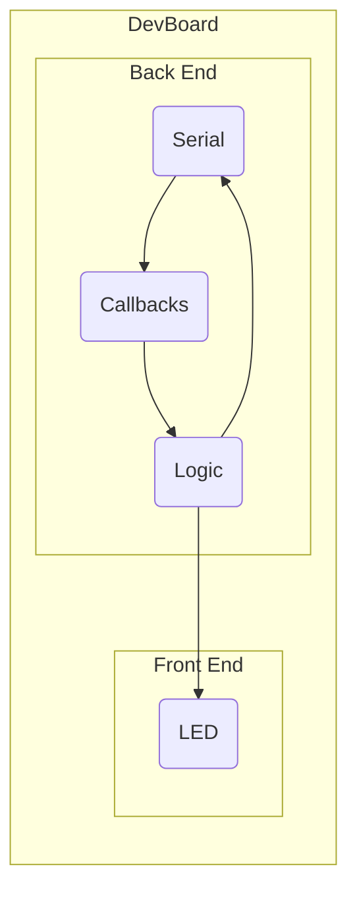

## Hello, World!

Let's print some messages over the USB connection.

First, you **MUST** enable CDC on boot on the Arduino IDE. This is a special setting to enable the Communications Device Class for the ESP32. Tools -> USB CDC On Boot -> Enabled


Now do:

```cpp
void setup() {
    Serial.begin(9600);
}

void loop() {
    Serial.println("Hello, World!");
    delay(1000);
}
```

This prints `Hello, World!` every second. But how can we see it?

If you are using the Arduino IDE, you can open the serial monitor, set the baudrate[^1] to `9600`, and watch the hello's flow in!

[^1]: The *baudrate* is the rate at which the signal on the wire can change in "baud's" per second.

Another way we can read these messages is with Python!

Python has a library called `pyserial`.

To install it in your active Python environment, simply run:

```
python -m pip install pyserial
```

...in your terminal.


  You can run `python -m serial` to determine the name of the port your DevBoard is on.


You can now open a Python file or REPL and write/run the following code:

```python
from serial import Serial, SerialException

with Serial('/your/port', 9600) as ser:
    while True:
        print(ser.readline().decode())
```

`.readline()` accumulates bytes until the newline (`\n` ) byte is received.

We use `.decode()` because `.readline()` returns `bytes` which can be _decoded_ into a string.

## Serial LED

Ok so we can send bytes from the DevBoard to our computer, but what about the other way 'round?

Let's try to control an LED from our computer. To do this, we need to send messages the other way.

We first set up *receiving* bytes over serial on the DevBoard:

### Interrupts

An *interrupt* is an event driven signal that runs code.

In our case, an event we care to *handle* is if we receive a byte over serial.

Luckily, this event is available to us, it's called `ARDUINO_HW_CDC_RX_EVENT`.

Wow, what it's trying to say is that if the serial port's *receive buffer* is not empty, this event will be triggered.

So let's define a function we want to be called when that event is triggered (we receive a byte):

```cpp
void on_receive(void* event_handler_arg, esp_event_base_t event_base, int32_t event_id, void* event_data) { ... }
```

> The signature of this function is defined by the type `esp_event_handler_t`. You can refer to Espressif's [documentation](https://docs.espressif.com/projects/esp-idf/en/latest/esp32/api-reference/system/esp_event.html) to see more.

Then, we register the interrupt with the `Serial` peripheral in our `setup()` like so:

```cpp
void setup() {
    pinMode(LED, OUTPUT);

    // register "on_receive" as callback for RX event
    Serial.onEvent(ARDUINO_HW_CDC_RX_EVENT, on_receive);
    Serial.begin(9600);
}
```

Ok, we also configure an LED to be an output, great.

Oh, and we correspond the byte received event to our function, nice!

### Serial

So, what should be in our `on_receive` function?

Well, the first thing we need to do is get the data from the serial port's buffer:

```cpp
// read one byte
char state { Serial.read() };
```

We consider each byte received to be the target LED state (*sent by the computer*).

Then we need to do some validation, we know the LED can only be set to `LOW`, or `HIGH`, so we need to check the received byte is equal to either of those:

```cpp
// guard byte is valid LED state
if (!(state == LOW || state == HIGH)) {
    // invalid byte received
    // what else should we do?
    return;
}
```

If we find the byte to be valid, we proceed to updating the LED:

```cpp
// update LED with valid state
digitalWrite(LED, state);
```

Ok, this is pretty good, let's hop back over to Python.

Let's try sending the byte `0x1` and see what happens:

```python
with Serial('/your/port', 9600) as ser:
    ser.write(bytes([0x1]))
    input() # keep port open to see the LED turn on
```

The LED should turn on!

Ok! This is cool! But...

### Validation

What if we send an invalid byte? How could the app know? It *should* know, right?

Validation is an important consideration when developing communication systems. So let's add it.

Let's create two more constants at the top of our file:

```cpp
const int LED { 17 };

// add these
const char S_OK { 0xaa };
const char S_ERR { 0xff };
```

We can send back one of these depending on the validity of the received data.

Let's go back and update `on_receive`:

```cpp
void on_receive(void* event_handler_arg, esp_event_base_t event_base, int32_t event_id, void* event_data) {
    // read one byte
    char state { Serial.read() };

    // guard byte is valid LED state
    if (!(state == LOW || state == HIGH)) {
        // invalid byte received
        // report error
        Serial.write(S_ERR);
        return;
    }

    // update LED with valid state
    digitalWrite(LED, state);
    Serial.write(S_OK);
}
```

Now whenever the app sends an LED state, it should expect a confirmation response.

You can try this in Python:

```python
with Serial('/your/port', 9600) as ser:
    ser.write(bytes([0x1]))
    assert ser.read() == bytes([0xaa])

    ser.write(bytes([0x0]))
    assert ser.read() == bytes([0xaa])

    ser.write(bytes([0x2]))
    assert ser.read() == bytes([0xff])
```

If an error is raised, one of these assertions failed!

### Loop?

What happened to `loop()`? What do we need to put in there?

Well...

```cpp
void loop() { }
```

Nothing!

Our code is completely interrupt driven, so the `loop` function need not be populated :)

At this point, we have completed half of the system!


