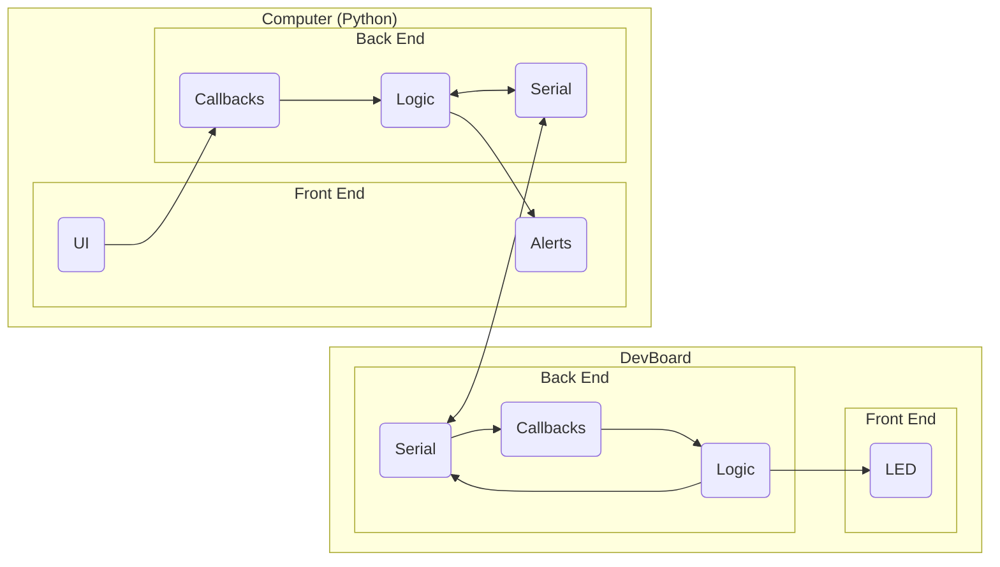
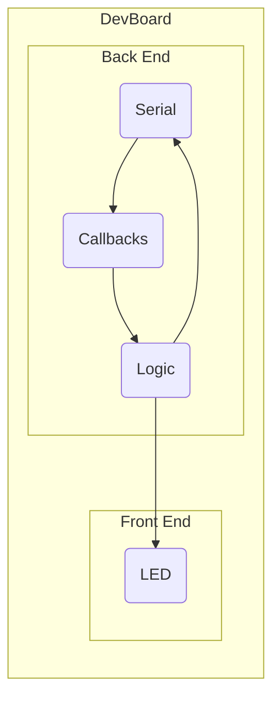

Let's take a look at the hierarchy of the system we are about to design:



Now, I know this looks complicated, but we will tackle each block one by one, nice and slow.

Once you are done with this, you will have a solid understanding of creating systems involving bidirectional communication between 2 devices, which is _super_ useful for _a ton_ of applications (including your final project).

So let's get started.

## Driving an LED

We'll start simple, and just make a user controllable LED blink once per second. Before you begin, make sure that your Board is configured to the ESP32S3 Dev Module.

On the DevBoard, the pin of the LED we will use is `17` (LED1).

Here is the code:

```cpp
const int LED{17};

void setup() {
    pinMode(LED, OUTPUT);
}

void loop() {
    digitalWrite(LED, HIGH);
    delay(1000);
    digitalWrite(LED, LOW);
    delay(1000);
}
```

The `setup` function runs once on boot.

The `loop` function runs over and over again forever.

## Hello, World!

Now let's print some messages over the USB connection.

```c
void setup() {
    USBSerial.begin(9600);
}

void loop() {
    USBSerial.println("Hello, World!");
    delay(1000);
}
```

This prints `Hello, World!` every second. But how can we see it?

If you are using the Arduino IDE, you can open the serial monitor, set the [baudrate](https://www.setra.com/blog/what-is-baud-rate-and-what-cable-length-is-required-1) to `9600`, and watch the hello's flow in!

Another way we can read these messages is with Python!

Python has a library called `pyserial`.

To install it in your active Python environment, simply run:

```
python -m pip install pyserial
```

...in your terminal.


  You can use Arduino IDE to determine the name of the port your DevBoard is on.


You can now open a Python file or REPL and write/run the following code:

```python
from serial import Serial, SerialException

with Serial('/your/port', 9600) as ser:
    while True:
        print(ser.readline().decode())
```

`.readline()` accumulates bytes until the newline (`\n` ) byte is received.

We use `.decode()` because `.readline()` returns `bytes` which can be _decoded_ into a string.

## Serial LED

Ok, so we can blink an LED, and we can send bytes from the DevBoard to our computer, but what about the other way 'round?

In order to control the LED from our computer, we need to send messages the other way.

To do this, we first set up _receiving_ bytes over serial on the DevBoard:

### Interrupts

An _interrupt_ is an event driven signal that runs code.

In our case, an event we care to _handle_ is if we receive a byte over serial.

Luckily, this event is available to us, it's called `ARDUINO_HW_CDC_RX_EVENT`.

Wow, what it's trying to say is that if the Serial port's _receive buffer_ is not empty, this event will be triggered.

So let's define a function we want to be called when that event is triggered (we receive a byte):

```c
void on_receive(void* event_handler_arg, esp_event_base_t event_base, int32_t event_id, void* event_data) { ... }
```

> The arguments of this function are defined by the type `esp_event_handler_t`. You can refer to Espressif's [documentation](https://docs.espressif.com/projects/esp-idf/en/latest/esp32/api-reference/system/esp_event.html) to see more.

Then, we register the interrupt with the `USBSerial` peripheral in our `setup()` like so:

```c
void setup() {
    pinMode(LED, OUTPUT);

    // register "on_receive" as callback for RX event
    USBSerial.onEvent(ARDUINO_HW_CDC_RX_EVENT, on_receive);
    USBSerial.begin(9600);
}
```

Ok, we also still configure the LED to be an output, great.

Oh, and we correspond the byte received event to our function, nice!

### Serial

So, what should be in our `on_receive` function?

Well, the first thing we need to do is get the data from the Serial port's buffer:

```c
// read one byte
int state = USBSerial.read();
```

We consider each byte received to be the target LED state (_sent by the computer_).

Then we need to do some validation, we know the LED can only be set to `LOW`, or `HIGH`, so we need to check the received byte is equal to either of those:

```c
// guard byte is valid LED state
if (!(state == LOW || state == HIGH)) {
    // invalid byte received
    // what else should we do?
    return;
}
```

If we find the byte to be valid, we proceed to updating the LED:

```c
// update LED with valid state
digitalWrite(LED, state);
```

Ok, this is pretty good, let's hop back over to Python.

Let's try sending the byte `0x1` and see what happens:

```python
with Serial('/your/port', 9600) as ser:
    ser.write(bytes([0x1]))
    input() # keep port open to see the LED turn on
```

The LED should turn on!

Ok! This is cool! But...

### Validation

What if we send an invalid byte? How could the app know? It _should_ know, right?

Validation is an important consideration when developing communication systems. So let's add it.

Let's create two more constants at the top of our file:

```c
const int LED{17};

// add these
const int S_OK{0xaa};
const int S_ERR{0xff};
```

We can send back one of these depending on the validity of the received data.

Let's go back and update `on_receive`:

```c
void on_receive(void* event_handler_arg, esp_event_base_t event_base, int32_t event_id, void* event_data) {
    // read one byte
    int state = USBSerial.read();

    // guard byte is valid LED state
    if (!(state == LOW || state == HIGH)) {
    // invalid byte received
    // report error
    USBSerial.write(S_ERR);
    return;
    }

    // update LED with valid state
    digitalWrite(LED, state);
    USBSerial.write(S_OK);
}
```

Now whenever the app sends an LED state, it should expect a confirmation response.

You can try this in Python:

```python
with Serial('/your/port', 9600) as ser:
    ser.write(bytes([0x1]))
    print(ser.read() == bytes([0xaa]))

    ser.write(bytes([0x0]))
    print(ser.read() == bytes([0xaa]))

    ser.write(bytes([0x2]))
    print(ser.read() == bytes([0xff]))
```

You should see 3 `True`'s.

### Loop?

What happened to `loop()`? What do we need to put in there?

Well...

```c
void loop() { }
```

Nothing!

Our code is completely interrupt driven, so the `loop` function need not be populated :\)

At this point, we have completed half of the system!



## App

Time for the other half...

This is going to be a lot, not gonna lie this is going to go pretty deep.

We need to write code that does the following:

- Renders the UI
- Handles the serial port
- Connects the UI and serial together

This may seem trivial at first, but you must realize that Python - by default - is single threaded. This means if we make a _Button_ that sends a message over serial, _by default_ the UI will be **frozen** until that serial code is done executing.

This is bad, we don't like this, so we will need to take care to design our app with _concurrency_ in mind.

### UI

Let's start easy and just set up a simple UI.

We will be using [Tkinter](https://docs.python.org/3/library/tkinter.html) for this app.

We start by creating the object that represents our Tkinter session:

```python
import tkinter as tk
import tkinter.ttk as ttk

class App(tk.Tk):
    def __init__(self):
        super().__init__()

        self.title("LED Blinker")

if __name__ == '__main__':
    app = App()
    app.mainloop()
```

Ok this is pretty neat, when you run this program you should see an empty window appear.

Let's add our UI elements (called "widgets" in Tkinter):

```python
def __init__(self):
    super().__init__()

    self.title("LED Blinker")

    ttk.Checkbutton(self, text='Toggle LED').pack()
    ttk.Button(self, text='Send Invalid').pack()
    ttk.Button(self, text='Disconnect', default='active').pack()
```

What a nice simple app.

We have:

- a checkbox to toggle the LED
- a button to test sending an invalid byte
- a disconnect button

### Backend

We now need to implement the missing backend components.

_How_ do we run code when the checkbox is checked or unchecked?

Well, `ttk.CheckButton` has two more kwargs: `variable` and `command`.

It will set the passed `variable` to the state of the checkbox on change, and call the passed `command` on change.

We need to create both of those though, let's start with the `variable`:

```python
self.led = tk.BooleanVar()

ttk.Checkbutton(self, text='Toggle LED', variable=self.led, command=self.update_led).pack()
ttk.Button(self, text='Send Invalid').pack()
ttk.Button(self, text='Disconnect', default='active').pack()
```

We create a member variable `led` that represents the state of the checkbox. It is a special Tkinter variable type that can be mutated and observed by Tkinter widgets.


  We need `led` to be a member variable, so we can access it throughout the lifetime of our `App` instance, even after the constructor finishes.


We also need to create the function `self.update_led()`:

```python
def update_led(self):
    value = self.led.get()

    # send `value` somehow??
```

Hmm... so how can we send our message?

We need to have access to the serial port in our app. Well, just like `led`, we can make a member variable of type `Serial`.

We can change our `App` class:

```python
class App(tk.Tk):
    ser: Serial

    def __init__(self):
        ...
```

Oh... but, how do we connect to the serial device? We can't just hardcode `/your/port` because it changes all the time.

We need to create a menu the user can select their port from and then connect.

Let's make another class called `SerialPortal` that provides this functionality:

```python
from serial import Serial
from serial.tools.list_ports import comports

class SerialPortal(tk.Toplevel):
    def __init__(self, parent: App):
        super().__init__(parent)

        self.parent = parent
        self.parent.withdraw() # hide App until connected

        ttk.OptionMenu(self, parent.port, '', *[d.device for d in comports()]).pack()
        ttk.Button(self, text='Connect', command=self.connect, default='active').pack()

    def connect(self):
        self.parent.connect()
        self.destroy()
        self.parent.deiconify() # reveal App
```

...and add the new popup window, a `connect` function and `port` variable to `App`:

```python
class App(tk.Tk):
    ser: Serial

    def __init__(self):
        super().__init__()

        self.title("LED Blinker")

        self.port = tk.StringVar() # add this
        self.led = tk.BooleanVar()

        ttk.Checkbutton(self, text='Toggle LED', variable=self.led, command=self.update_led).pack()
        ttk.Button(self, text='Send Invalid').pack()
        ttk.Button(self, text='Disconnect', default='active').pack()

        SerialPortal(self) # and this

    # and finally this
    def connect(self):
        self.ser = Serial(self.port.get())

    def update_led(self):
        value = self.led.get()

        # send `value` somehow??
```

Ok cool, now we can fill in `update_led`:

```python
def update_led(self):
    self.ser.write(bytes([self.led.get()]))
```

At this point, checking the LED checkbox should toggle the LED!

But there is still more to do...

---

Let's finish the backend for the _Send Invalid_ and _Disconnect_ buttons:

```python
def disconnect(self):
    self.ser.close()

    SerialPortal(self) # display portal to reconnect

def send_invalid(self):
    self.ser.write(bytes([0x10]))
```

This is pretty great, but we haven't used the response from the DevBoard yet, you'll notice clicking the _Send Invalid_ button does nothing.

We should standardize writing to the serial port by making one `write` function that all callbacks use.

First add this import for displaying an alert:

```python
from tkinter.messagebox import showerror
```

Then define the same constants as in our firmware on the DevBoard:

```python
S_OK: int = 0xaa
S_ERR: int = 0xff
```

And finally add the `write` function to `App`:

```python
def write(self, b: bytes):
    try:
        self.ser.write(b)
        if int.from_bytes(self.ser.read(), 'big') == S_ERR:
            showerror('Device Error', 'The device reported an invalid command.')
    except SerialException:
        showerror('Serial Error', 'Write failed.')
```

Now we can change our callbacks that wrote to the serial port to use this:

```python
def update_led(self):
    self.write(bytes([self.led.get()]))

def send_invalid(self):
    self.write(bytes([0x10]))
```

And now these will properly handle an `S_ERR` response.

### Safe Resource Acquisition

Another thing we need to do is make sure our serial port is properly closed when our app exits.

We can achieve this by allowing `App` to be constructed in a managed context.

This is what the [with](https://docs.python.org/3/reference/compound_stmts.html#with) keyword is for in Python.

To add this support to `App`, we add these functions:

```python
def __enter__(self):
    return self

def __exit__(self, *_):
    self.disconnect()
```

And change our main code to guarantee resource release:

```python
if __name__ == '__main__':
    with App() as app:
        app.mainloop()
```

### Threading

Right now, if any serial code gets stuck or just takes a long time, our UI will freeze for that time.

To avoid this, we need to make sure all registered callbacks spawn as a [detached thread](https://www.youtube.com/watch?v=-i8Kzuwr4T4).

We can make a helper [decorator](https://peps.python.org/pep-0318/) that we can use to mark any functions we want to be spawned in a detached thread:

```python
from threading import Thread, Lock # we'll use Lock later ;)

def detached_callback(f):
    return lambda *args, **kwargs: Thread(target=f, args=args, kwargs=kwargs).start()
```

> Don't worry too hard about understanding this decorator, just know it coerces the function it's applied to into being spawned _into a thread_ upon invocation.

This decorator can be applied to our callbacks like so:

```python
@detached_callback
def update_led(self):
    self.write(bytes([self.led.get()]))
```

We have one final problem to solve...

It is now possible that multiple threads could try to use the serial port at once, this would cause [undefined behavior](https://en.wikipedia.org/wiki/Undefined_behavior) in the form of a [race condition](https://en.wikipedia.org/wiki/Race_condition).

To solve this, we need to wrap the `Serial` object in a [lock](https://docs.python.org/3/library/threading.html#threading.Lock).

We can do this by creating a new type, `LockedSerial`:

```python
class LockedSerial(Serial):
    _lock: Lock = Lock()

    def __init__(self, *args, **kwargs):
        super().__init__(*args, **kwargs)

    def read(self, size=1) -> bytes:
        with self._lock:
            return super().read(size)

    def write(self, b: bytes, /) -> int | None:
        with self._lock:
            super().write(b)

    def close(self):
        with self._lock:
            super().close()
```

Our custom type inherits from `Serial` and overrides the member functions we use with a lock acquisition of the super's implementation.

Effectively, our type behaves _exactly like the `Serial` type_ but with a lock around every function call.

Now replace every use of the `Serial` type with `LockedSerial`.

## What Just Happened

Ok! That was a lot! But i'm glad you made it :\)

You now know how to:

- write interrupt driven firmware
- use the serial peripheral
- digital communication between two devices
  - validate data
- create user interfaces with Python
  - interaction between front and back end
- threading
  - locks
