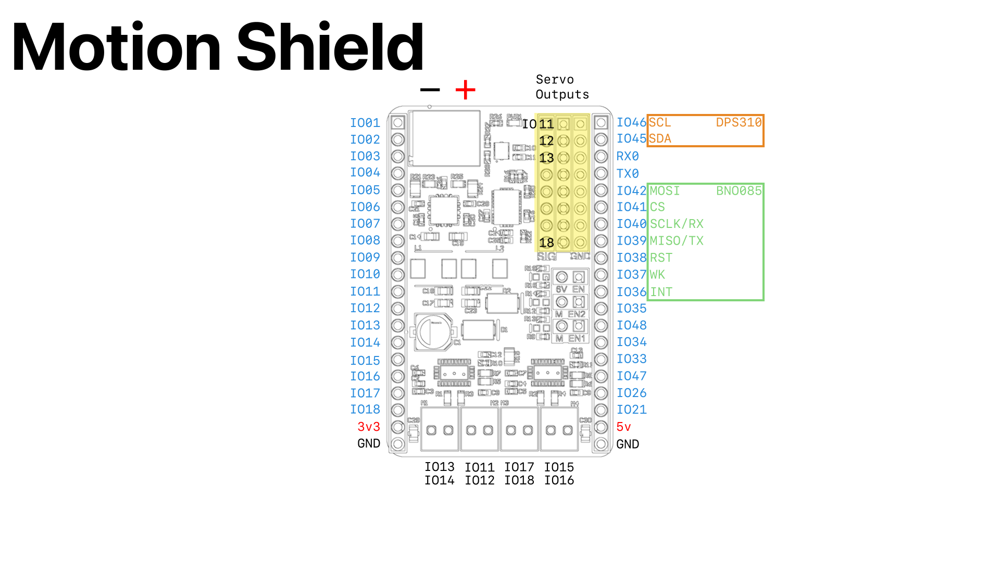

It's time to get our hands dirty and really change this firmware. We're going to make a motor spin, but to do that, firmware won't be enough.

## Preparation

Pick up a **Motion Shield** and:
- 9v battery and connector
- DC motor
- Jumper
- Wires
- Tiny screwdriver



This ^ is the pinout diagram for the motion shield. It shows you how GPIO from the DevBoard are allocated.

We want to spin a motor, so we're going to use one of the motor output ports at the bottom.

## How do motors work?

The standard method of driving DC motors is with a structure called a **Full Bridge**:


There are two output stages that can assert a voltage of either **GND** or **VS**.

If stage **A** is `HIGH` and stage **B** is `LOW`, current would flow through the motor
from `+` to `-` and the motor would exert a torque $\vec \tau$.

If stage **A** is `LOW` and stage **B** is `HIGH`, current would flow through the motor
from `-` to `+` and the motor would exert a torque $-\vec \tau$.

So let's try it. Looking at the bottom of the pinout diagram, we can see which GPIO
correspond to each motor port.

Solder some wires onto your motor and plug them into a motor port. Also, place a jumper
on the enable port for the motor channel you are using.

Let's change our blinky code to configure two more output pins:

```cpp
const unsigned int LED{17};
// add these
const unsigned int MTR_HI{?};
const unsigned int MTR_LO{?};

void setup() {
    pinMode(LED, OUTPUT);
    // and these
    pinMode(MTR_HI, OUTPUT);
    pinMode(MTR_LO, OUTPUT);

    // configure pins to spin the motor in a direction
    digitalWrite(MTR_HI, HIGH);
    digitalWrite(MTR_LO, LOW);
}
```

Run this, and watch the motor spin!

You can reverse the direction by inverting the levels of these pins. Try it!

## Greater Granularity

You don't *always* want to exert maximum torque in either direction, but rather some
*proportion* of the maximum torque.

To achieve this, we can use **P**ulse **W**idth **M**odulation (PWM).

Rather than holding the output stages steady at `HIGH` or `LOW`, we can rapidly
change the state, targeting an on *proportion*.

Imagine we hold stage **B** `LOW`, and over intervals of `1us`, pull stage **A** `HIGH` for `200ns`
and `LOW` for the remaining `800ns`. *On average*, it would look as though the voltage on the switch
node of stage A were $V_s \cdot \frac{200ns}{1us}=0.2V_s$, which roughly corresponds to 1/5th
the maximum torque.

Arduino let's us do this with the `analogWrite` function.

`analogWrite` accepts values in the range `0..=255` (unsigned 8bit integer).

The following is the equivalent of our previous test but with `analogWrite`:

```cpp
analogWrite(MTR_HI, 255);
analogWrite(MTR_LO, 0);
```

Run this and watch the motor spin!

Swap these numbers and watch it spin the other way!

## Challenge

Make the motor smoothly oscillate back and forth between spinning forward and backward.
