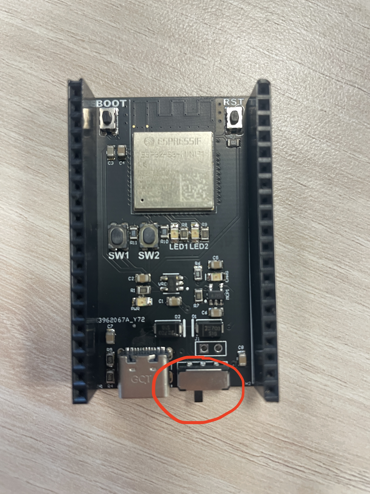
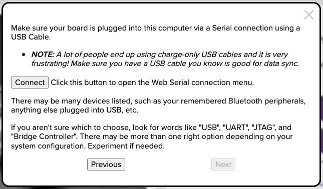
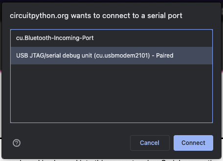
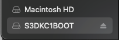
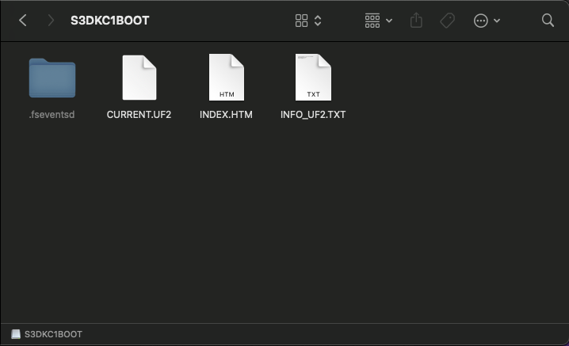
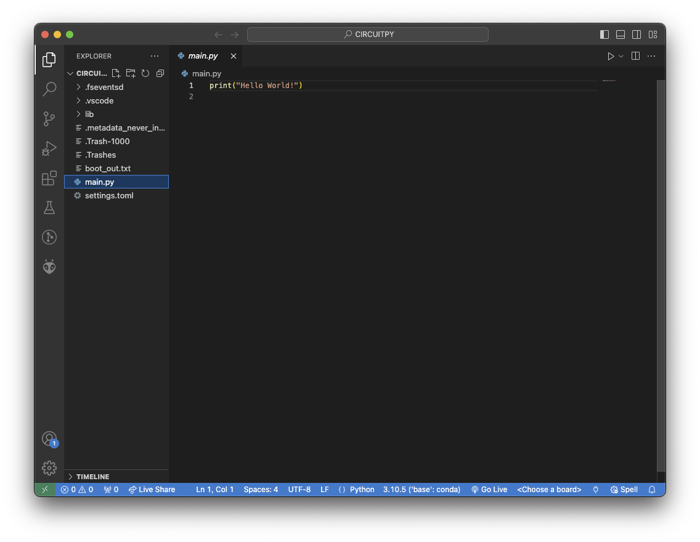
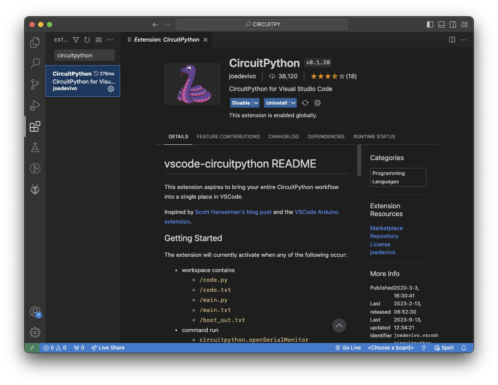
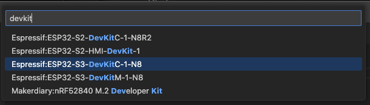

It's time to start writing code for your board!

For this assignment, we have opted to use [CircuitPython](https://circuitpython.org) to demonstrate just how easy embedded development can be.

## Setup CircuitPython

### Preparation

#### Download Binary

The first step is to download [this](https://github.com/ECE-196/VUMeter/blob/main/envision_mini_devboard_cp_firmware.uf2) file. (No need to open it just remember where you put it)

> Why? This is the CircuitPython binary we made for the EnVision DevBoard that tells CircuitPython what pins are available, what processor is in use, etc.

#### Connect the Mini DevBoard

1. Switch the DevBoard's power switch to `OFF`
2. Plug it in to your computer
3. Press and hold the `BOOT` button
4. Switch the power switch to `ON`
5. Release the `BOOT` button

(Refer to table to determine on/off switch positions)

| ON                    | OFF                    |
| --------------------- | ---------------------- |
|  |  |


  You may see a pop-up asking if you would like to allow the USB device to connect, of course, click yes.


### Uploading

#### Bootloader

**With a [Chromium](https://www.google.com/search?q=chromium+browsers) based browser...**

Navigate to [this](https://circuitpython.org/board/espressif_esp32s3_devkitc_1_n8) page.

Click "_Open Installer_"...

and then click "_Install Bootloader Only_".

Click "_Next_" until you reach this screen:

Click "_Connect_". This dialog should appear:


  You may need to grant your browser permission to access your USB ports.


Click "_Connect_".

Click "_Continue_" and wait for the bootloader to flash...

When it finishes you may close this page.

#### CircuitPython

Reset the DevBoard by pressing the `RST` button or by toggling the power switch to `OFF` and then `ON` again.


  Another USB access dialog may appear, allow it.


You should see a mass storage device has mounted...

with these contents:

Drag and drop the downloaded binary from [earlier](https://github.com/ECE-196/VUMeter/wiki/Firmware#download-binary) onto the mass storage device.

When the transfer is complete, it will disconnect, and a new drive will appear:


  If a keyboard dialog appears, click "_Quit_"


### Setup Workspace

Now that CircuitPython has been installed on your DevBoard, you can open VSCode in the `CIRCUITPY` directory.

Click "_Open Folder_" and select the `CIRCUITPY` directory.

The first thing you should do is rename `code.py` to `main.py`.

_So how do I run this?_ you may ask.

Well we first need to tell VSCode how to interact with our CircuitPython runtime.

Luckily for us, there is a VSCode extension for this!

Navigate to the extensions pane and search "_python_", install the first result.

Then search "_circuitpython_" -- there should only be one result -- and click install.

Then go back to the explorer pane and select `main.py`.

In the bottom right, click "_\<Choose a board>_", then search for the `ESP32-S3-DevKitC-1-N8`.

Then press the little USB icon next to that button, or open the command pallette and search "_open serial_".

Select the appropriate USB port.

You should see this pane appear:

Congrats! You can now interact with the CircuitPython REPL just like Python on your computer.

Also, any code you write in `main.py` will run on the DevBoard when it powers on, you reset it with `Ctrl + D`, or change your code.

There are lots of resources for learning how to use CircuitPython on their [website](https://circuitpython.org).

#### This doesn't work

If for whatever reason you can't get VSCode or the CircuitPython extension to work on your computer, you can try:

- [Mu Editor](https://learn.adafruit.com/welcome-to-circuitpython/installing-mu-editor)
- [Online Editor](https://code.circuitpython.org)

## Challenge

We have some starting code for you [here](https://github.com/ECE-196/VUMeter/blob/main/main.py) to get started with the VU behavior.


  Because the VSCode extension for CircuitPython does not know about the EnVision Mini DevBoard, you will see errors whenever you use pins `IO26`, `IO33`, or `IO34`. These errors are not real and can be suppressed by adding `# type: ignore` on any line dealing with those pins.


Think about the following:

1. How do you get the volume of the environment from the microphone?
2. How do you only turn on certain LEDs based on this number?
3. How do you do this in realtime?

## Extra Credit

Filter the displayed volume to slowly go down but still quickly go up, to give a better visual of the volume in the room.
