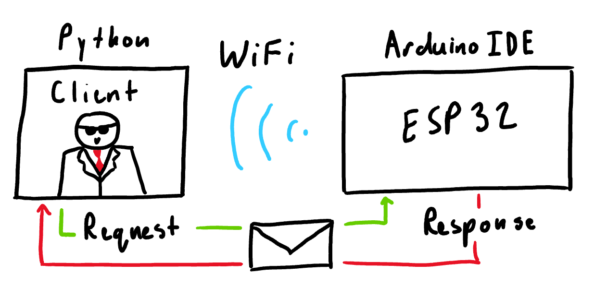
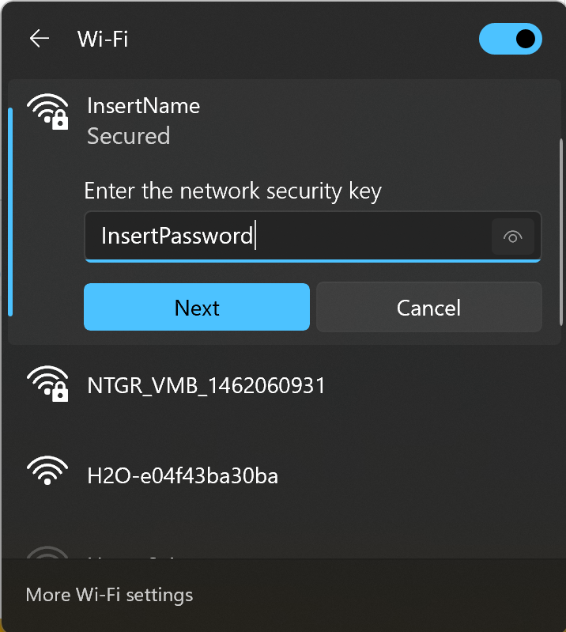
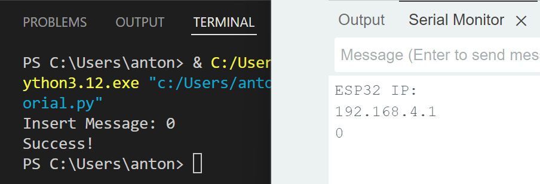

## Introduction

In this tutorial we will teach you how to use a python script to communicate with your ESP32! In a previous tutorial you learn how to send signals over the serial peripheral interface (SPI), now we will teach you how to send signals wirelessly. We hope this short simple tutorial can help kickstart your project so you don't have to tirelessly search online watching YouTube videos and reading forums like we did!

### Learning Objectives

- Coding using Python / Arduino IDE
  - Learn about sockets and wireless access points

### Background Information

We will discuss how to setup your ESP32 as a SoftAP (software enabled access point) and how you can use sockets in Python to communicate to your ESP32 over this wireless access point. We use the WiFi capability of the ESP32 as one of the main methods for wireless communication. The key concepts you should understand beforehand are basic coding skills using Python/Arduino, but it is helpful to read into SoftAP and sockets before starting.

## Getting Started

You should have the Arduino IDE and your preferred Python IDE already downloaded, but if not I would recommend using Visual Studio Code. This is all you will need for the software side of things and this will suffice for both Windows and Mac. In terms of hardware, all you will need is your ESP32 and motor shield / motor provided in the previous tutorial (Spinning and Blinking).

### Required Downloads and Installations

[Arduino IDE](https://www.arduino.cc/en/software)  

[Visual Studio Code](https://code.visualstudio.com/download)

### Required Components

| Component Name | Quanitity |
| -------------- | --------- |
| ESP32          | 1         |
| Motor Shield   | 1         |
| Motor          | 1         |

### Required Tools and Equipment

- Computer, Arduino IDE, Python IDE

## Part 1: Setting Up the SoftAP

### Introduction

In this section you will learn how to set up your ESP32 as a wireless access point and setup client compatability.

### Objective

- Learn how to utilize ESP32's WiFi functionality
- Perpare your ESP32 to communicate with clients

### Background Information

At this point you should know the basics of coding with Arduino which is all you will need for this section. We will set up our ESP32 as a wireless access point then set it up to be able to communicate with clients. In this case our client will be a python script but we will delve into that in the next part. So grab your ESP32, open your Arduino IDE, and lets go!

### Instructions

Open up a new sketch and include the WiFi.h library. 
```c
#include <WiFi.h> 
```

Now we can create a WiFiServer object, this will allow the ESP32 to act as a SoftAP (software enabled access point). The server object requires a server port for its constructor. Server port 80 is used for HTTP (hypertext transfer protocol), so we can use that for now. 
```c
const int serverPort(80); 
WiFiServer theServer(serverPort); 
```

Every WiFi network has it's own credentials, i.e. name and password. So lets set up a name and password for our ESP32. 
```c
const char* theSSID { "InsertName" }; 
const char* thePassword { "InsertPassword" }; 
```

Now we can create the SoftAP and start the server. Add the following code in your setup block. 
```c
WiFi.softAP(theSSID, thePassword); 
theServer.begin(); 
```

After setting up the SoftAP we can find the ESP's IP using this line of code:
(**Hint:** Set up the Serial to print the IP)
```c
WiFi.softAPIP(); 
```

In the loop function we will handle client requests. 
```c
void loop() { 
  delay(1000); 

  WiFiClient theClient = theServer.available();

  if(theClient) {
    while(theClient.connected()) {
      if(theClient.available()) {
      }
    }
  }
  theClient.stop();

}
```

We can receive and send signals using .readString() and .write(). 
```c
String theReceived = theClient.readString(); 
theClient.write("Success!"); 
```

Finally, upload the code and watch your ESP32 network pop up!

  


Note:
  - You can also use .read() but this can only read a single char
  - We add a delay to allow time for connecting and for client requests to come in
  - leaving the password string empty makes your network publicly available
  - The ESP32 access point does not actually give you WiFi so you can't access the internet or other services that need it, it simply acts as a wireless network for your ESP
    - It is possible to setup the ESP32 as a WiFi repeater but that is not covered in this tutorial

## Part 2: Creating the Client

### Introduction
In this section we learn how to create clients with sockets in python, enabling wireless communication with our ESP32.

### Objective
- Learn how to use sockets in python
- Client compatibility with ESP32

### Background Information
Now that we have set up the ESP32's wireless network we can create client communication using sockets in python. We have already setup client compatibility in part 1 so lets put it together!

### Instructions

Open your Python IDE, create a new python script, and include the socket library. 
```python
import socket
```

To connect to our ESP32 via the socket you need the ESP's IP and server port. 
```python
ESP_IP = ""; # Hmmmm, did I print that IP ?
serverPort = ; # Which port did we use again ?
```

Now our client can connect through the socket, add this line to your code: 
```python
with socket.socket(socket.AF_INET, socket.SOCK_STREAM) as theSocket:
    theSocket.connect((ESP_IP, serverPort));
```

We can send information by using .sendall(). We can do this by encoding a string with the .encode() function. Our code may look like this: 
```python
aString = "0"; 
theSocket.sendall(aString.encode()); 
```

Now if we run the python script our ESP32 will receive "0". Check to see if this is true by making the serial print the received data!

We receive information using .recv() and .decode(). 
```python
theReceived = (theSocket.recv(1024)).decode(); 
```
Now if we run the python script we should see the message sent back to us by the ESP32!



Note:
- You must be connected to your ESP32 WiFi network to allow the client to communicate with the ESP32 through the socket

## Example

### Introduction

Now that we know how to set up our ESP32 as a wireless access point and we can create a client in python, let's put it all together and make a led blink on our ESP32 devboard using a wireless signal!

### Code

```c
#include <WiFi.h> 

const char* theSSID { "CoolESPAccessPoint" };
const char* thePassword { "" };

const int serverPort(80);
WiFiServer theServer(serverPort);

const int theLED { 17 };

void setup() {
  pinMode(theLED, OUTPUT);
  Serial.begin(9600);
  WiFi.softAP(theSSID, thePassword);
  Serial.println(WiFi.softAPIP());
  theServer.begin();
}

void loop() {
  delay(1000);

  WiFiClient theClient = theServer.available();

  if(theClient) {
    while(theClient.connected()) {
      if(theClient.available()) {
      String theReceived = theClient.readString();
      Serial.println(theReceived);
        if(theReceived == "Blink") {
          digitalWrite(theLED, HIGH);
          delay(1000);
          digitalWrite(theLED, LOW);
          theClient.write("Success!");
        }
      }
    }
  }
  theClient.stop();

}
```

```python
import socket

ESP_IP = ""; # Put the IP that was printed in the Serial
serverPort = 80;

with socket.socket(socket.AF_INET, socket.SOCK_STREAM) as theSocket:
    theSocket.connect((ESP_IP, serverPort));
    theSocket.sendall(("Blink").encode());
    print((theSocket.recv(1024)).decode());
```

### Analysis

Upload the Arduino code to your ESP32 and connect to the WiFi network. Now when you run the python script you should see the LED blink and in your terminal "Success!". Now if you plug in your ESP32 to an external power supply, say the motor shield with the battery plugged in, you should be able to find and connect to it's network and run the python script to send signals wirelessly, try it for yourself!

To summarize, we set up the ESP32 as a SoftAP using the WiFi.h library. We can then set up a WiFiServer to allow it to talk to clients. Using sockets in python we can create a client that is able to communicate back and forth to our ESP32 through requests.

## Challenge

Let's use all this new knowledge to create a way to turn a motor on and off by sending it signals in python! Can you create a python script that takes in user input and sends it to the ESP32? Can you make it so our ESP32 can handle the requests "On" and "Off" in your Arduino IDE to allow the ESP32 to turn it's motor on and off respectively?
(**Hint**: Use the input() function to take user inputs in python.)


## Additional Resources

### Useful links

[How to Set an ESP32 Access Point (AP) for Web Server](https://randomnerdtutorials.com/esp32-access-point-ap-web-server/)  

[Information on Sockets in Python](https://docs.python.org/3/library/socket.html) 
