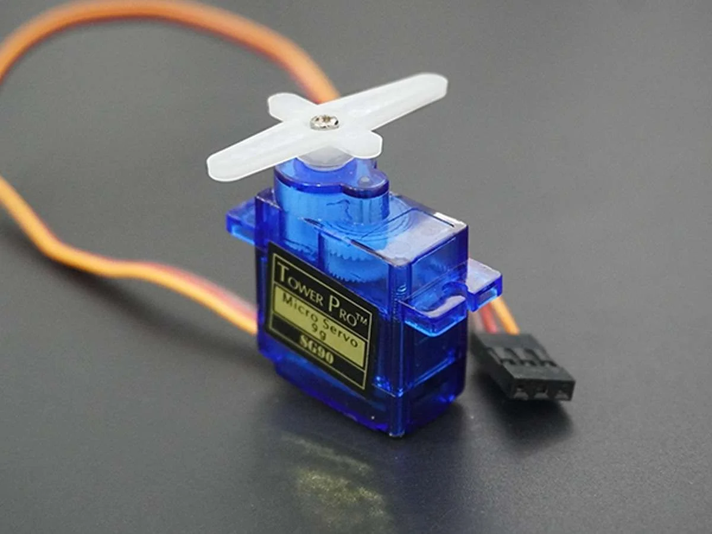
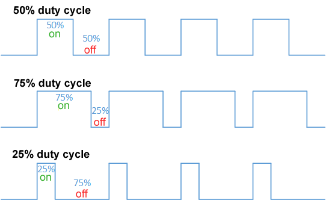

## Introduction

After finishing this tutorial you will know how to control servos using an ESP32 Envision DevBoard!

Expanding your component knowledge is essential for being able to create new projects. Servos can be applied in different projects relating to smart locks, robotic arms, and more!. This tutorial demonstrates how to control a servo motor using CircuitPython without relying on external libraries for Servos. Instead, we’ll directly generate PWM signals to control the servo. This lightweight approach is suitable for those who want minimal dependencies.

### Learning Objectives

- Understand how PWM works with ESP32 DevBoard and CircutPython.
- Learn how to connect and control a servo motor.

### Background Information

Servos are devices that can move in an angular manner. They are motors with integrated controllers that are widely used in robotics, RC vehicles, and other applications requiring precise movement. The ESP32 can generate PWM signals, making it ideal for controlling servos. Here's an overview:

**Pros**:
  1. Precise control of angular position.
  2. Easy integration with microcontrollers.
  3. Compact and energy-efficient.

**Cons**:
  1. Limited to specific angular ranges (e.g., 0-180°).
  2. Requires a stable power source.

### Understanding PWM

PWM (Pulse Width Modulation) is a technique used to control devices like servos by modulating the width of digital pulses in a periodic signal.

#### Key Characteristics

1. **Frequency**:
   - Defines the rate at which the signal repeats, measured in Hertz (Hz).
   - For standard servos, the frequency is **50 Hz**, meaning the signal repeats every 20 milliseconds.
   - **1 ms = 1000 / 1 HZ**

2. **Duty Cycle**:
   - Represents the percentage of time the signal is HIGH in each cycle.
   - **Duty Cycle = Time HIGH (ms) / Time per cycle (ms) * 100**
   - Example:
     - **1 ms HIGH** → 5% duty cycle (0° position).
     - **1.5 ms HIGH** → 7.5% duty cycle (90° position).
     - **2 ms HIGH** → 10% duty cycle (180° position).

   

3. **Pulse Width**:
   - The duration the signal remains HIGH in each cycle.
   - Directly determines the angular position of the servo.

#### PWM in Servo Control

- The servo interprets the width of the PWM pulse to determine its position.
- Typical pulse widths for servos:
  - **1 ms** → 0° (minimum position).
  - **1.5 ms** → 90° (center position).
  - **2 ms** → 180° (maximum position).
  

#### Practical Example

At a frequency of **50 Hz (20 ms period)**:
- A pulse width of **1 ms** corresponds to a duty cycle of 5%.
- A pulse width of **1.5 ms** corresponds to 7.5%.
- A pulse width of **2 ms** corresponds to 10%.

#### Advantages of PWM

1. **Precision**: Fine control over angular movement.
2. **Energy Efficiency**: Digital signals switch between HIGH and LOW states, consuming less power.
3. **Compatibility**: Most servo motors are designed to work with PWM signals.

#### Common Issues with PWM

1. **Incorrect Frequency**:
   - Ensure the PWM frequency matches the servo's specifications (typically 50 Hz).
2. **Signal Noise**:
   - Use proper grounding and avoid interference from other components.
3. **Mapping Errors**:
   - Verify that pulse widths correctly map to the intended servo angles.

## Getting Started

### Required Downloads and Installations
1. Install [this](https://circuitpython.org/board/espressif_esp32s3_devkitc_1_n8) firmware for you DevBoard.
2. Download and install the bootloader for the Devboard [here](https://circuitpython.org/board/espressif_esp32s3_devkitc_1_n8/) in **Open Installer** (Make sure to use a Chromium based browser).
3. Move the firmware into the file system of the DevBoard.
4. Install VS Code for writing code [here](https://code.visualstudio.com/).
5. Go to extension and download the **CircutPython** extension

### Required Components

| Component Name      | Quantity |
|---------------------|----------|
| ESP32               | 1        |
| Servo Motor         | 1        |
| Jumper Cables       | 3        |

### Required Tools and Equipment

- Visual Studio Code
- CircutPython extension
- USB cable for connecting the microcontroller.

---

## Part 01: Setting Up the Circuit

### Introduction

This section explains how to connect the servo motor to your DevBoard.

### Objective

- Set up the circuit to control a servo using PWM.
- Understand the required connections for a servo motor.

### Background Information

Servos require three connections:
- **Signal**: Connect to a GPIO pin capable of PWM.
- **Power**: 5V, shared with the ESP32, or external.
- **Ground**: Shared with the ESP32.

### Components

- ESP32
- Servo Motor.
- Jumper Cables

### Instructional

1. Connect the servo’s signal wire (yellow or white) to GPIO Pin 46.
2. Connect the servo’s power wire (red) to the 5V pin on your DevBoard or an external power source.
3. Connect the servo’s ground wire (black or brown) to GND.


## Part 02: Writing the Code

### Introduction

This section provides the code to control the servo motor. The PWM signal will directly manage the servo’s angle.

### Objective

- Generate PWM signals to control a servo.
- Map servo angles to PWM duty cycles.

### Background Information

PWM signals simulate analog outputs by varying the duty cycle of a digital signal. The servo interprets these signals to move to a specific angle.

### Components

- Microcontroller with CircuitPython.
- Computer with a text editor.

### Instructional

1. Import CircutPython modules for controlling your board

```python
import board
import pwmio
import time
```
2. Initialize a PWM pin out to control your servo

```python
servo_pwm = pwmio.PWMOut(board.IO46, duty_cycle=0, frequency=50)
```
3. Set up helper method for controlling servo angle

```python
def set_servo_angle(pwm, angle):
    # Map the angle (0-180) to a duty cycle (2.5% to 12.5% for typical servos)
    min_duty = 0.025  # 2.5% duty cycle
    max_duty = 0.125  # 12.5% duty cycle
    duty_span = max_duty - min_duty

    duty_cycle = min_duty + (angle / 180) * duty_span
    pwm.duty_cycle = int(duty_cycle * 65535)  # Convert to 16-bit duty cycle

```

4. Create event loop to set angle

```python
while True:
     set_servo_angle(servo_pwm, 90)
```

5. Now you try setting different angles and see what you get!

## Additional Resources

- [CircutPython Docs](https://docs.circuitpython.org/en/latest/README.html)
- [PWM Guide](https://learn.sparkfun.com/tutorials/pulse-width-modulation/all)
